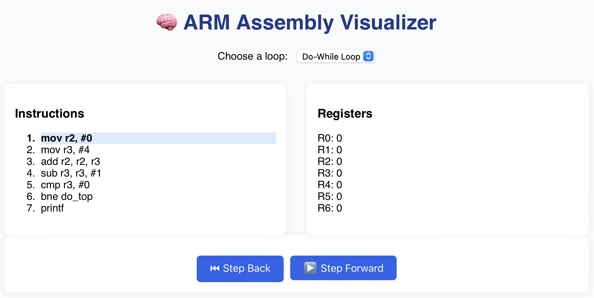

# 🧠 ARM Assembly Visualizer

A visual learning tool built in **React** that simulates the execution of common loop structures in **ARM Assembly language**, step by step.

💻 Perfect for students, educators, and curious engineers looking to understand how low-level assembly instructions change register values in real-time.

Adapted from the original ARM Assembly code in my GitHub repo below:
📁 **GitHub Repo:** [https://github.com/TrishaAndres/arm-assembly-loops](https://github.com/TrishaAndres/arm-assembly-loops)

---

## 🔗 Live Demo

🌐 [View on Netlify](https://armassembly.netlify.app)

---

## 🎮 Demo Features

✅ Choose between four assembly patterns:
- `Do-While Loop`
- `While Loop`
- `If-Else Statement`
- `Mathematical Expression Loop`

✅ Live visualization of:
- Instruction execution (with highlighting)
- Register state updates (R0–R6)
- Control flow (branching and conditional logic)
- Step Forward ⏭️ and Step Backward ⏮️ navigation

---

## 🧰 Tech Stack

| Layer    | Tech                  |
|----------|-----------------------|
| Frontend | React                 |
| Styling  | CSS Modules           |
| Data     | Simulated JSON traces |

---

## 🚀 Getting Started Locally

```bash
git clone https://github.com/TrishaAndres/arm-assembly-visualizer.git
cd arm-assembly-visualizer
npm install
npm start
```

---

🗂️ Project Structure

src/
├── components/             # Reusable UI components
│   ├── ControlPanel.js
│   ├── InstructionViewer.js
│   └── RegisterPanel.js
├── data/                   # Instruction sequences
│   ├── doWhile.json
│   ├── whileLoop.json
│   ├── ifElse.json
│   └── loop.json
├── styles/
│   └── App.css
├── App.js                  # Core logic
└── index.js

---

📷 Preview



